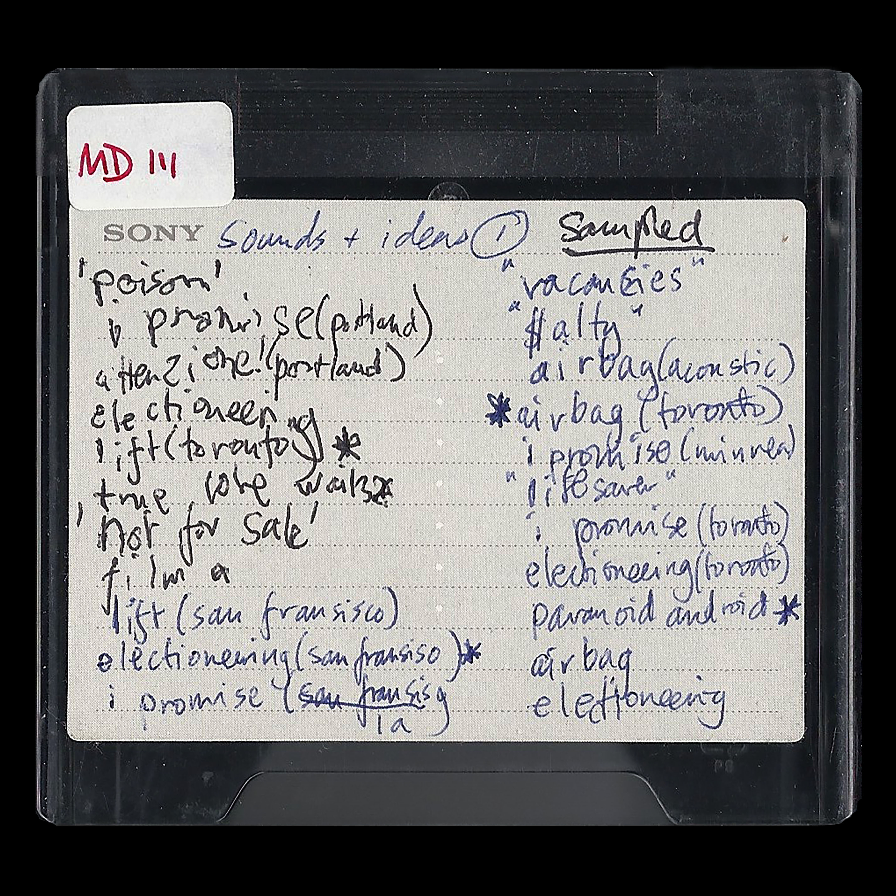
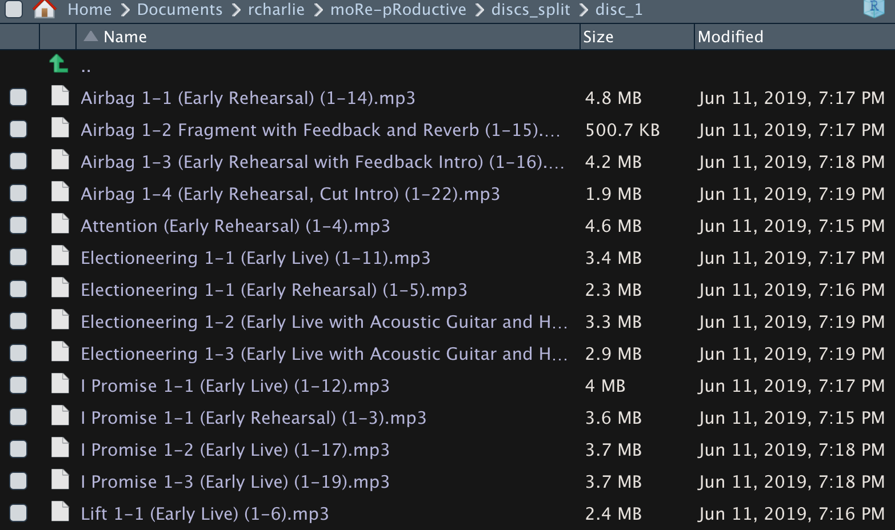

# moRe-pRoductive
R script to parse the tracks from Radiohead's OK Computer Minidisc recordings (official bandcamp mp3 only)

## Instructions

1) Buy and download mp3 version from [Bandcamp](https://radiohead.bandcamp.com/)
2) Unzip mp3s into `discs_original` directory
3) Download and install [ffmpeg](https://ffmpeg.org/) (can use `brew install ffmpeg` on mac)
4) Download and install [R](https://www.r-project.org/) and [RStudio](https://www.rstudio.com/)
5) Clone this repository
6) Open `moRe-pRoductive.Rproj` within Rstudio
7) Open and run `splitter.R`
8) New mp3s will appear in `discs_split` directory. Took about 10 minutes for me, but that may vary depending your machine.
9) Enjoy

## Disclaimer
This script works only for the official mp3 bandcamp downloads which you can buy [here](https://radiohead.bandcamp.com/).

This work is based directly off this [document](https://docs.google.com/document/u/1/d/1kA8u6UhjbutZ-b7TXzmX4qkOTg6nGC1vPg50WwCcZyo/preview?sle=true), which was crowdsourced by [Reddit](https://www.reddit.com/r/radiohead/comments/bwzag6/entire_ok_computer_sessions_have_been_leaked/) users. I've checked a handful of mp3s for accuracy, but there may be incorrect labels.
